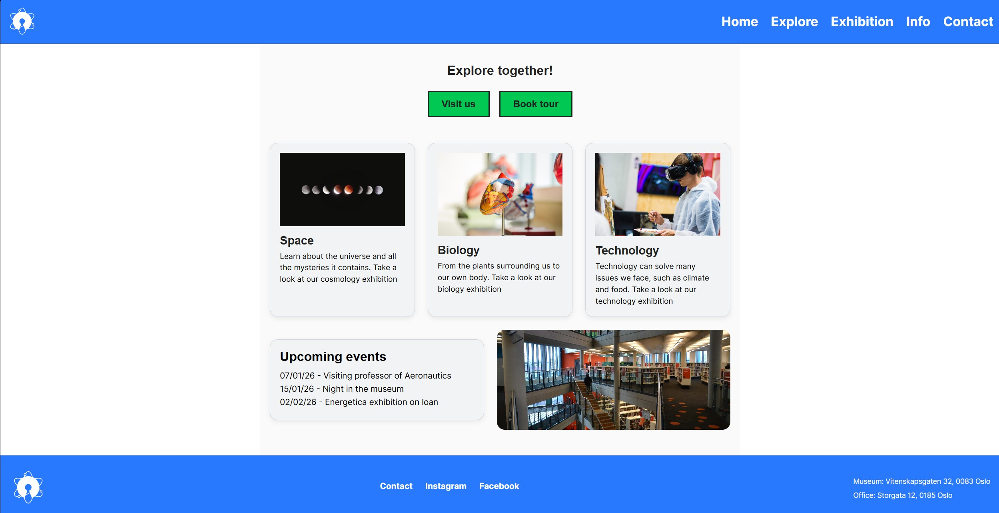

# Community science museum 

CSM is a responsive informational website for a fictional science museum with children, families and schools as their target audience.

## Description
This project was created as my Semester Project 1. The goal was to design and build a website for a community science museum using HTML, CSS and GitHub projects. The website presents museum information, exhibitions, visitor details and content for different target groups. 

 Features 
- Responsive design
- Home page
- Explore page
- Exhibition page
- Visitor information page
- Contact page
- Mobile navigation
- Improved visual consistency and accessibility

## Built with
- HTML
- CSS
- Figma

## Contact
[LinkedIn](https://www.linkedin.com/in/remi-ytterdahl/?locale=en)

remiytter@hotmail.com

## Author

Remi Ytterdahl
